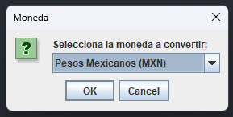
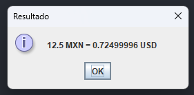

# Conversor de moneda - Challenge ONE Java

## Descripción

Este programa permite convertir una cantidad de dinero en Pesos Mexicanos, Dólares Estadounidenses, Euros, Libras Esterlinas, Yenes Japoneses y Won Surcoreano. Fue desarrollado en Java y es parte del desafío de alura latam "Conversor de moneda - Challenge ONE Java".

## Imagenes

